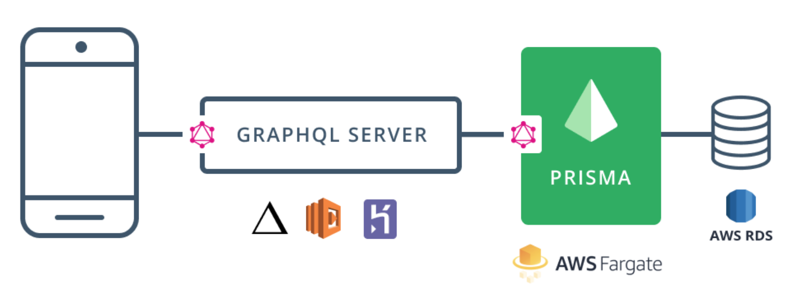

# Red Queen
This is a full-stack application with the purpose of migrating current data to AWS's RDS MySQL by implementing Serverless framework for the back-end and developing a front-end analytical tool with React.js and applying GraphQL to query the new database.
<!-- ## Getting Started
These instructions will get you a copy of the project up and running on your local machine for development and testing purposes. See deployment for notes on how to deploy the project on a live system. -->
<!-- ### Prerequisites
You will need to sign up for an AWS account (credit card information will be needed).


## Test
Run `sls invoke local -f launch` to invoke the lauch function locally 
## Deployment
Run `sls deploy` to deploy the application. -->
### Installing
* Run `yarn init -y`
* Run `yarn install`
* Create *.env*:
```
MY_AWS_REGION = 
AWS_PROFILE = 
AWS_ACCOUNTID = 
SQS_QUEUE_NAME = 
RDS_HOSTNAME = 
RDS_USERNAME = 
RDS_PASSWORD = 
RDS_PORT = 
RDS_DB = 
LK_ALLIANCE_DATA_URL = 
LK_PLAYERS_DATA_URL = 
LK_HABITATS_DATA_URL = 
BUCKET_NAME = 
IDENTITY_POOL_ID =
SLS_DEBUG=*
```
* Run `sls deploy`
## Built With
* [Serverless framework](https://serverless.com/)
* [AWS](https://aws.amazon.com/)
    - Lambda
    - SQS (decoupling solutions)
    - S3
    - RDS MySQL
    - Fargate
    - Identity and Access Management (IAM)
    - CloudWatch
    - CloudFormation
* [React.js](https://reactjs.org/) 
* [Apollo](https://www.apollographql.com/) 
* [Node.js](https://nodejs.org/en/) 
* [GraphQL](https://graphql.org/) 
* [Prisma](https://www.prisma.io/) 

## Back-end:


## Demos:
Part 1 | Serverless - AWS: [![Watch the video]](https://drive.google.com/file/d/1bKuYU4d5reCn6skRklZQ0ynnvOnvARJX/view)
## Authors
* **Anh Lu**
<!-- ## License
This project is licensed under the MIT License - see the [LICENSE.md](LICENSE.md) file for details -->
<!-- ## Acknowledgments
* Hat tip to anyone whose code was used
* Inspiration
* etc -->
